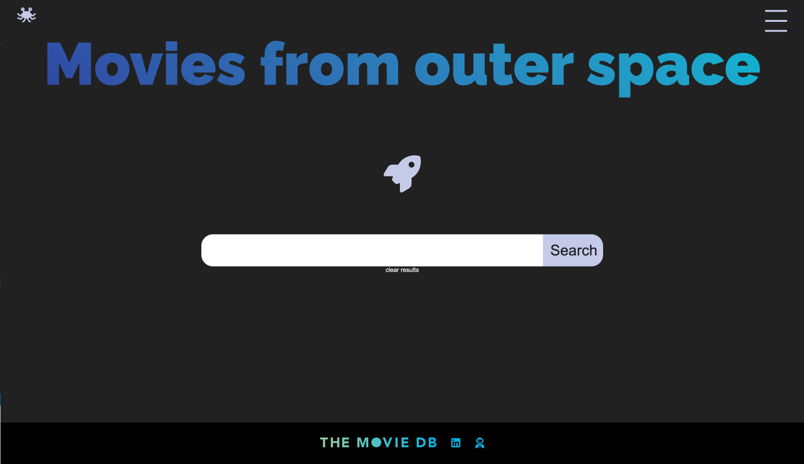

# Movies from Outer Space

## Description
Movies from outer space is a website dedicated to Sci-fi Movies. It is a place to find all kinds of Sci-fi films, and discover crazy and weird plots. 



 ---
## Tools

It uses The Movie Data Base to fetch movies in the Sci-Fi genre, and it divides pages based on decades from the past century. The site is built with Next JS, TypeScript, and Node, and it is deployed on Vercel (https://moviesfromouterspace.click/)

---

## Insctructions 
1. Clone the repository in your local machine
````
git@github.com:apardor/movies_from_outer_space.git
````
2. CD into folder and run `npm i`
3. Create a .env.local file on the root folder and add your TMDB credentials
````
API_URL=https://api.themoviedb.org/3/
TMDB_API_KEY= your__key
````
4. `npm run dev``
5. Open (http://localhost:3000/)
6. Find movies! :)
